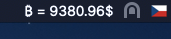

# ₿ btcPriceTicker_macOS



Simple status bar bitcoin price ticker for macOS. This tool can show you average price of BTC in USD online. Tested on macOS 10.15 with SWIFT5.

Data are provided from CoinGecko free API. https://www.coingecko.com/en/api

## How to modify

Data refresh time is set to 30 sec and can be modified in `AppDelegate.swift`

```swift
let updateTimeout : UInt32 = 30
```

Conversion currency can be simply modified in `BtcPriceProvider.swift`. Supported currencies can be found here https://www.coingecko.com/en/api.

```swift
let requestUrl = "https://api.coingecko.com/api/v3/simple/price?ids=bitcoin&vs_currencies=usd" // modify this -> vs_currencies=usd
let usdPrice = json["bitcoin"]["usd"].doubleValue // and this -> ["usd"]
```

